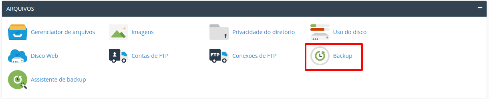
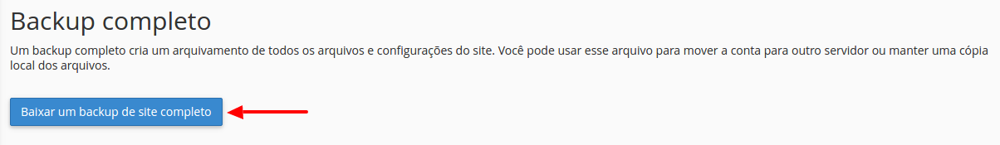
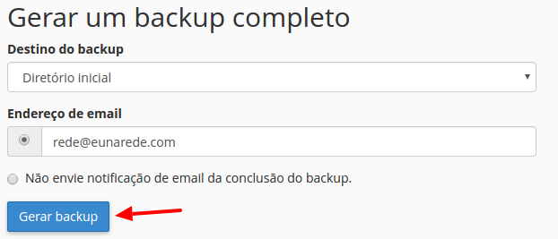
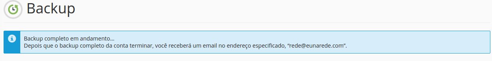

Neste artigo lhe ajudaremos a criar um 'full backup' do cPanel. Como o próprio nome descreve, trata-se de um backup completo de sua conta, incluindo e-mails, estatísticas, arquivos de websites, banco de dados etc. Siga o procedimento abaixo:

1. Faça o login no painel de controle cPanel (Ex.: http://www.seudominio.com/cpanel/).
2. Na aba 'Arquivos' localize o item 'Backups', e acesso-o.

3. Neste página você terá a opção de fazer um backup completo ou backups parciais. O aconselhável é sempre gerar um backup completo. Clique no item 'Fazer Download ou Gerar um Backup de Website Completo'.

4. Na tela seguinte, clique em 'Gerar Backup'.

> O backup será gerado pelo servidor automaticamente. Esse processo poderá demorar alguns minutos, de acordo com o tamanho do seu site.

Após aguardar o tempo que julgar necessário, clique no botão 'Voltar'. Se a geração de backup não tiver sido completada, você verá a mensagem [in progress], e deverá aguardar mais um pouco pelo término do processo. Atualize a página (pressione F5) para verificar se o processo já foi completado.

5. Com o arquivo backup gerado, clique uma vez no nome do backup. O download será iniciado.

! Se você possui uma conta de hospedagem compartilhada (P, M, G e Plus) ou revenda, não deixe de apagar o arquivo de backup após baixá-lo! Nossos termos de serviço não permitem o armazenamento de backups em contas de hospedagem compartilhada e revenda!