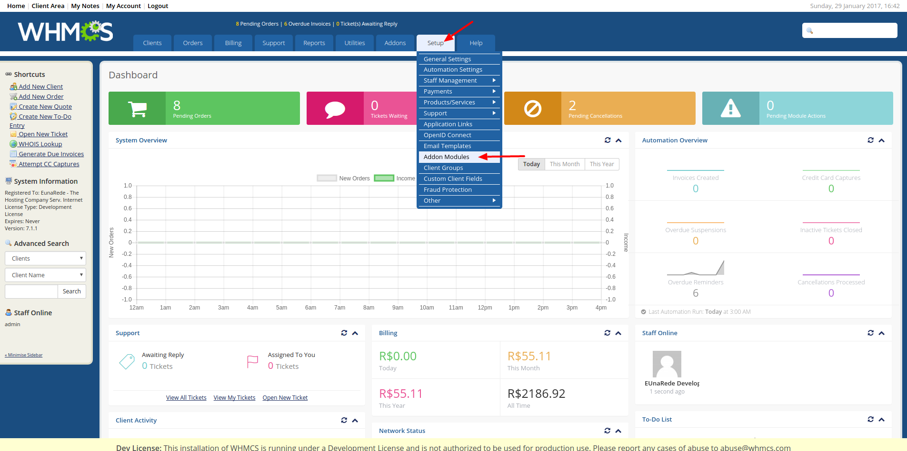
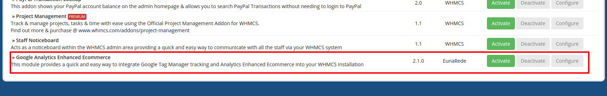

## Module Setup

The setup of Google Analytics Enhanced Ecommerce is very simple. Follow the steps bellow.

!! ensure that the [EunaRede Core module](/whmcs-gtm/installing-eunarede-core-module) is enabled **before** activating the acquired module.

### Activate the Addon Module

Go to ``` Setup >> Addon Module``` to activate the Google Analytics Enhanced Ecommerce.



Locate the module and click on **Activate** button.



