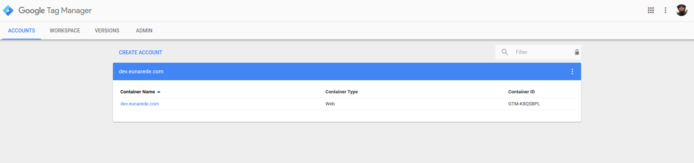

## Creating an account and container

The account is the topmost level of organization in Tag Manager. Typically, only one account is needed per company. Tags for all the company’s websites can be be managed from this single account.
You can create and/or administer multiple Tag Manager accounts from a single Google account. This allows you to conveniently manage tracking and campaigns for more than one company. Each time you sign in to Google Tag Manager, you’ll see the list of the Google Tag Manager accounts to which your Google Account has access.

[plugin:youtube](https://youtu.be/SMUPmrHipWs)