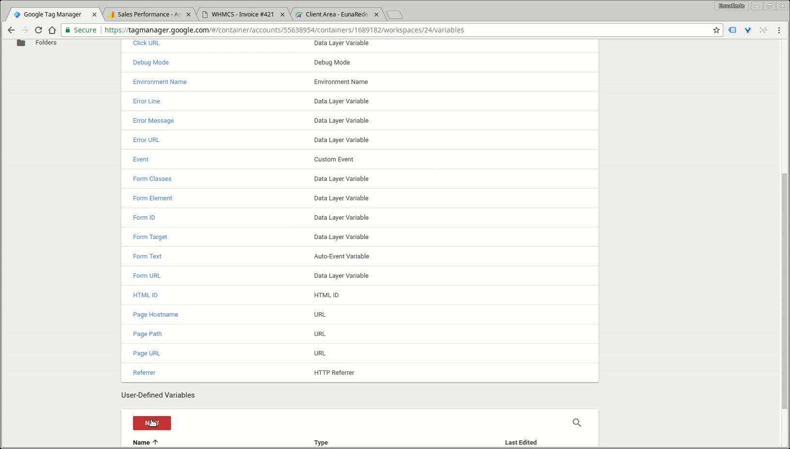
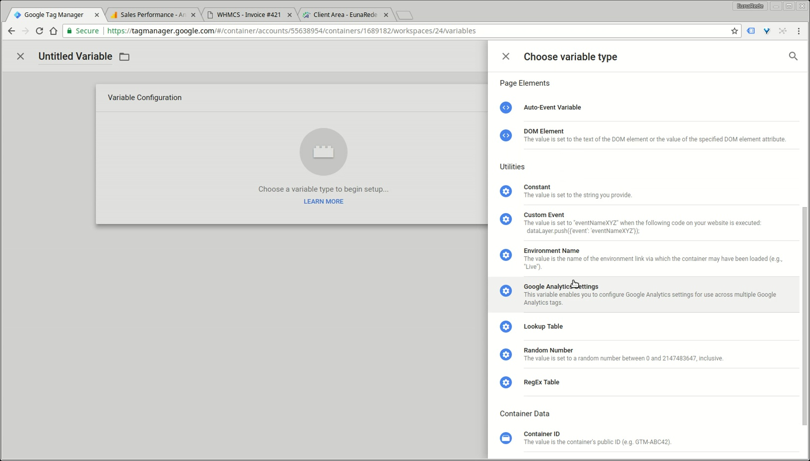
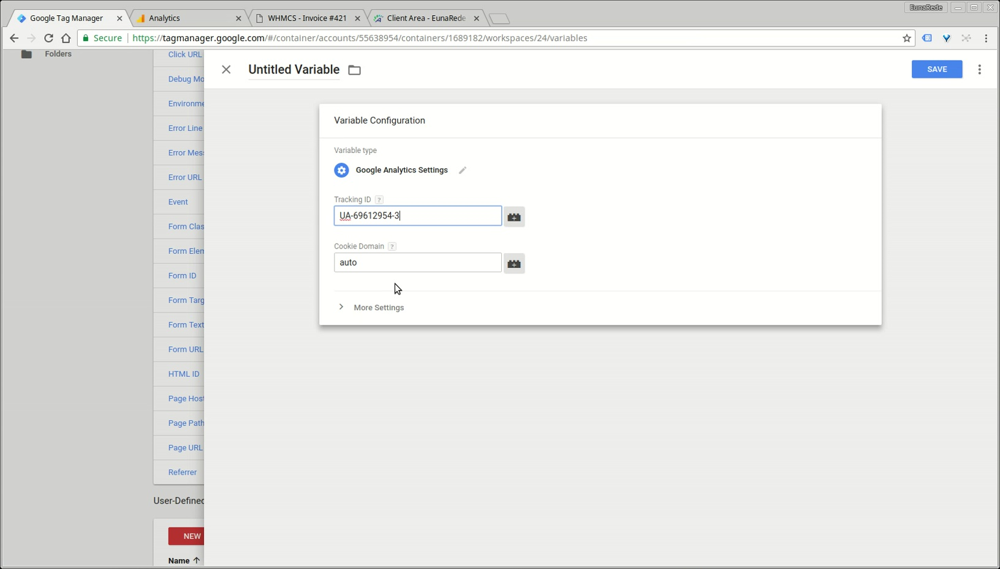
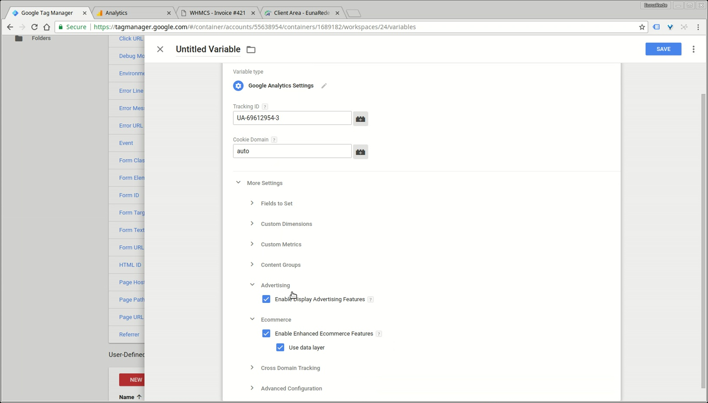
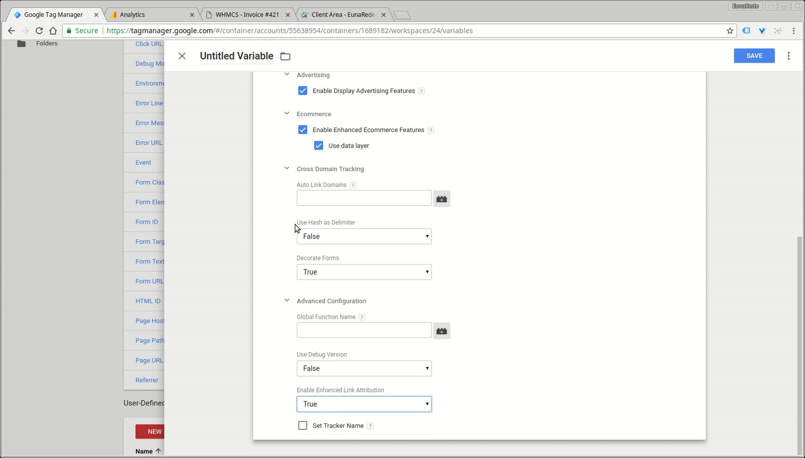

Recently Google Tag Manage implemented a global variable for the container with default configuration of Google Analytics settings. Use this variable to pass all necessary informations to your tracking tags.

! If you already have this variable configured, please review the configurations and make the necessary adjustments. **If you can't change the seetings of existing variable, please create a new one**.

Select your container tag, go to _Variables_ option and click in the **new** button on the **User-Defined Variables** section.

On **Variable Configuration** choose the variable type **Google Analytics Settings**

Paste your Google Analytics Tracking ID and click in **More Settings**.

Enable **Enable Display Advertising Features** on _Advertising_ dropdown and **Enable Enhanced Ecommerce Features** under _Ecommerce_ option. Please **don't forget** to check the option **user data layer**.

To anhanced the tag features, we recommend that you:

* Change to **true** the option **Decorate Forms** on _Cross Domain Tracking_
* Change to **true** the option **Enable Enhanced Link Attribution** on _Advanced Configuration_

Now save the changes and go trought the next steps!