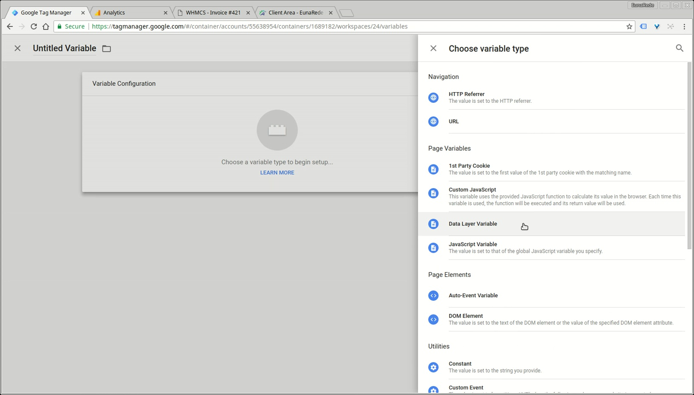
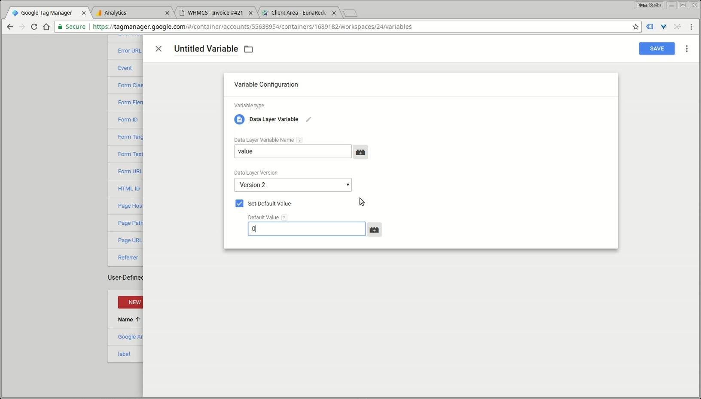
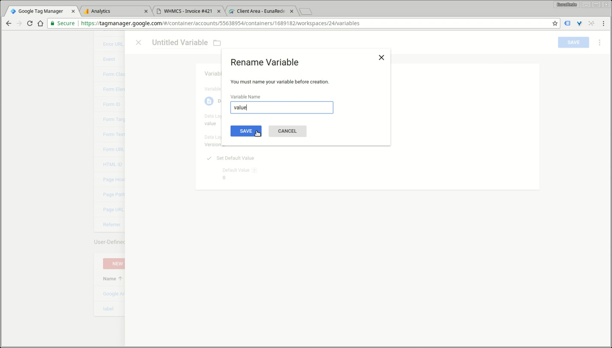

## Add variables

To your module works as promised, you will need to configure some variables in the container ID for WHMCS previously created. Insert all variables defined below on **User-Defined Variables**

### List of Variables

Configure the following variables:

|  Name  |  Type  |  Data Layer Variable Name  |	Default Value	|
|  :-----          |  :-----          |  :-----          |	:-----		|
|  category |  Data Layer Variable |  `category` |	|
|  event |  Data Layer Variable | `event`  |	|
|  label |  Data Layer Variable |  `label`  |	|
|  language |  Data Layer Variable |  `language`  |	|
|  locale |  Data Layer Variable |  `locale` |   |
| pageTitle | Data Layer Variable | `pageTitle` | |
| template | Data Layer Variable | `template` | |
| userID | Data Layer Variable | `userID` | |
| userType | Data Layer Variable | `userType` | |
| value | Data Layer Variable | `value` | 0 |

