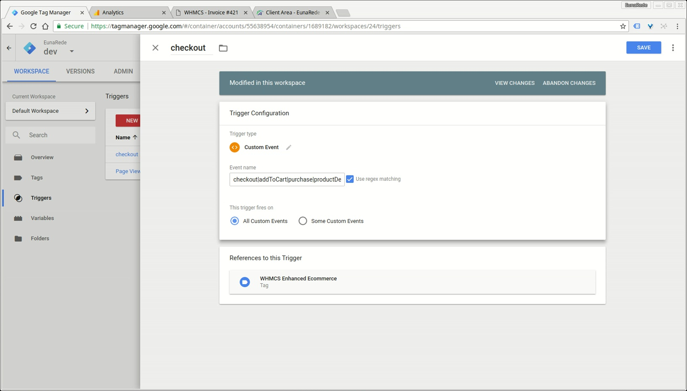

## Add triggers 

A trigger is a condition that evaluates to either true or false at runtime. Triggers attached to a tag govern when the tag is fired or not fired. To the correct function of tag analysis, you need configure a trigger with all passing events from the module.

Go to _Trigger_ option, click in **new**. Choose a **Custom Event** trigger type and configure the follow Event name:

* `checkout|addToCart|purchase|productDetails|productImpression`
* Check _Use regex matching_

! If you are upgrading the module to version 3.0, please remove the existing trigger.

