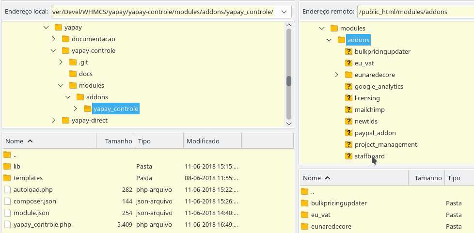

Tapay Controle para WHMCS é o módulo Addon responsável pela configuração/parametrização dos gateways de pagamento Yapay Direct e Yapay Manager.

## Instalação

### Upload

Realizar o upload da pasta “yapay_controle” dentro da pasta “modules/addons/” do servidor:

Selecione a pasta local e a pasta remota conforme abaixo:

Realize o upload:

### Ativar Módulo

Clique no menu: **Opções -> Módulos Addons**, e localize o módulo “Yapay WHMCS Controle” e clique no botão “Ativar”.

Clique no botão “Configurar”, marque o checkbox de “Full Administrator” e clique em salvar:

### Configurar Licença

Clique no menu **Addons->EunaredeCore**:

No quadro “Configurar Licenças”, selecione o módulo “Yapay WHMCS Controle”, preencha a licença e clique no botão “Salvar”:

O Módulo Yapay WHMCS Controle irá aparecer como ativo, e com sua respectiva chave no quadro da direita “Módulos Ativos”:

### Configuração do Módulo

Clique em “Addons->Yapay WHMCS Controle”:

! Observe que estará previamente selecionada a opção “Homologação” em “Ambiente de Operação”. Isso deverá ser alterado para “Produção” após ter realizado as devidas verificações preliminares de funcionamento.

Clique no botão “Salvar”.