# Yapay Direct para WHMCS

> Realize transações de forma direta e transparente com a Yapay através do Módulo Yapay Direct para WHMCS

O Módulo Yapay Direct é um portal de pagamentos para WHMCS integrado com o intermediador Yapay. O Módulo Yapay Direct possibilita o pagamento direto no intermediador Yapay, garantindo maior segurança, melhor confiabilidade e mais agilidade no processo de compras.

O Módulo Yapay Direct conta com toda a váriedade de formas de pagamentos disponíveis no intermediador Yapay. O módulo Yapay Direct para WHMCS é fácil de instalar e seguro de operar, os dados do cartão de crédito do seu cliente não serão armazenados no WHMCS. Conte também com a funcionalidade de notificações automáticas de pagamento das transações realizadas no intermediador Yapay.

## Instalação

Para realizar a instalação do módulo, siga a documentação a seguir.

### Upload

Realize o upload da pasta `modules` para a respectiva pasta no diretório de instalação do seu WHMCS.

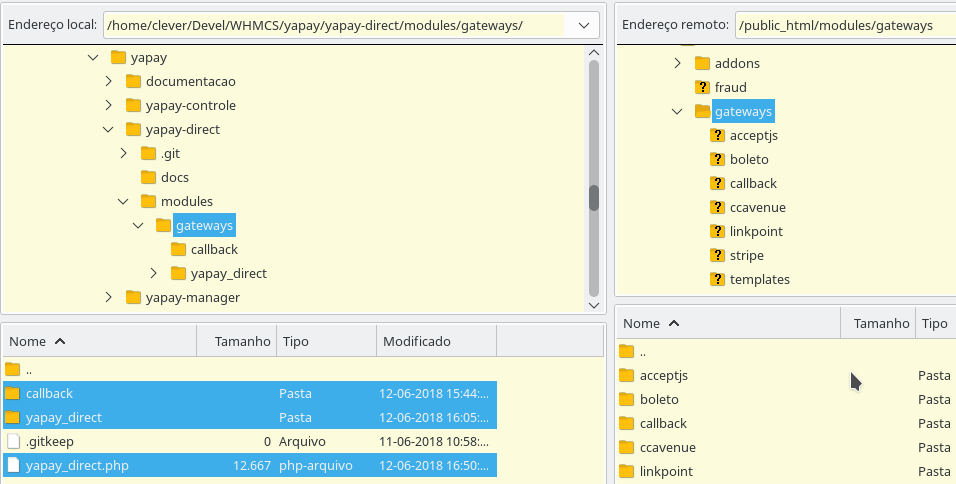

### Ativação do portal de pagamento

Clique no menu `Opções -> Pagamentos -> Portais de Pagamentos`:

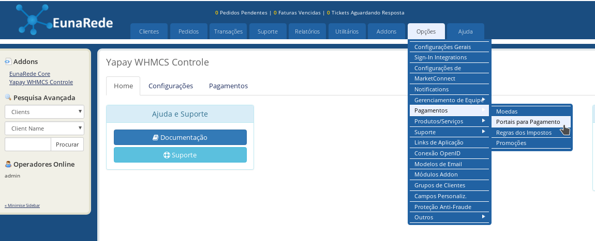

Digite a senha do administrador:

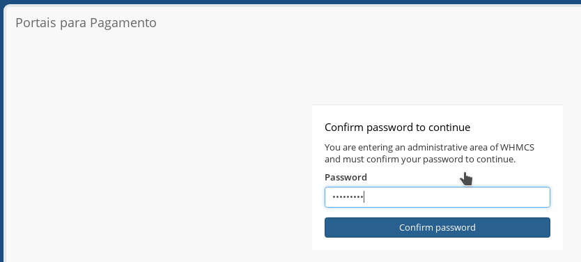

Localize o portal “Yapay WHMCS Direct”, e clique nele:

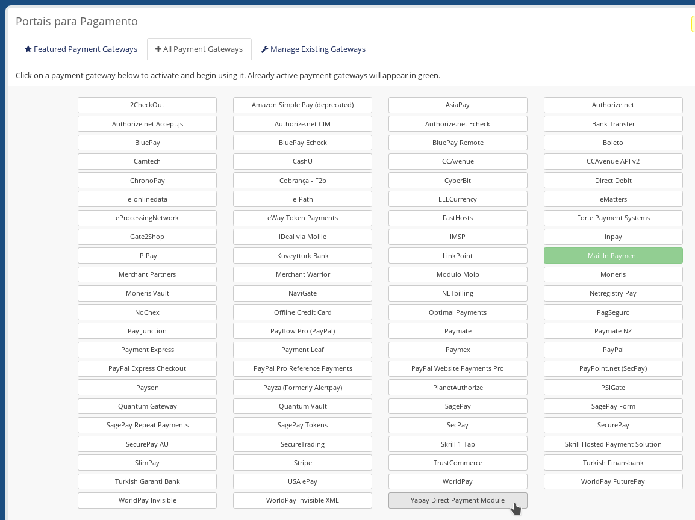

Irá aparecer a seguinte tela informando que o portal foi ativo:

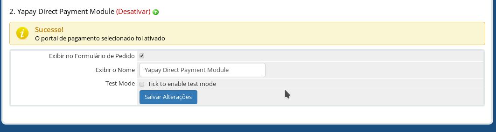

### Simulação de compra

Simulação de uma compra de produto com pagamento no Yapay, utilizando o módulo. Como cliente do WHMCS, adicione no carrinho um produto:

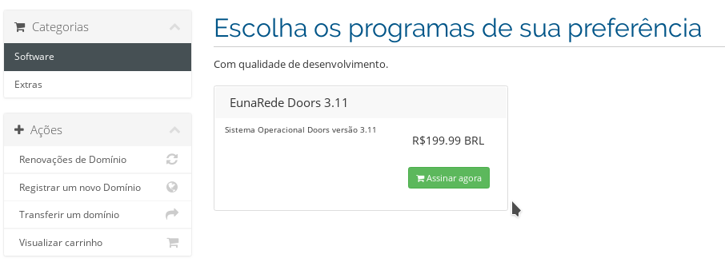

Na Revisão do Pedido, clique no botão “Finalizar”:

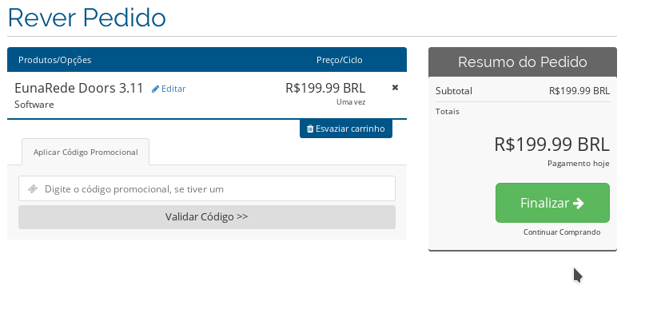

Em Finalizar, verifique que a forma de pagamento escolhida seja o Yapay Direct, e clique no botão _Completar Pedido_:

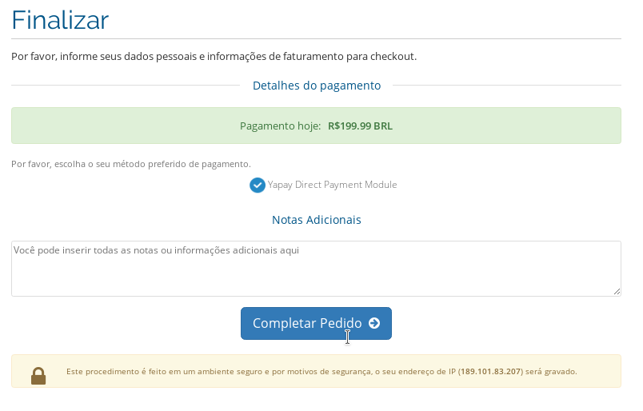

Irá aparecer a seguinte tela, e em alguns segundos (5), será redirecionado para o portal Yapay, para promover o pagamento, se isso não ocorrer automaticamente, clique no botão “Clique aqui para pagar com Yapay”:

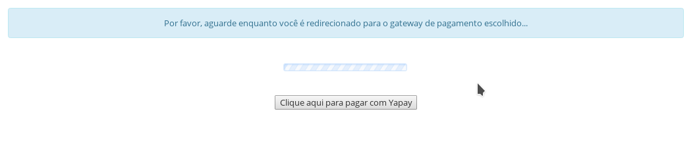

No portal Yapay, será necessário escolher uma senha (senha para este email no portal Yapay - ela será requisitada toda vez que outra compra for realizada) e informar os dados/forma de pagamento:

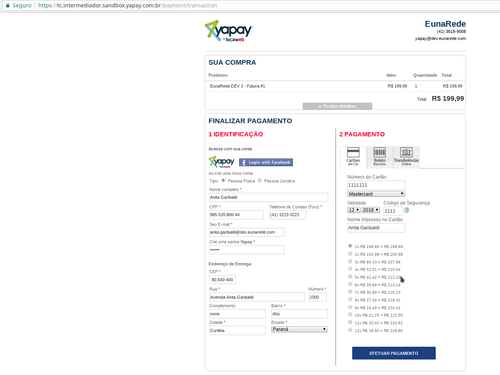

Após o Yapay aceitar o pagamento, a seguinte tela será apresentada, e em 10 segundos será redirecionado novamente para o portal WHMCS:

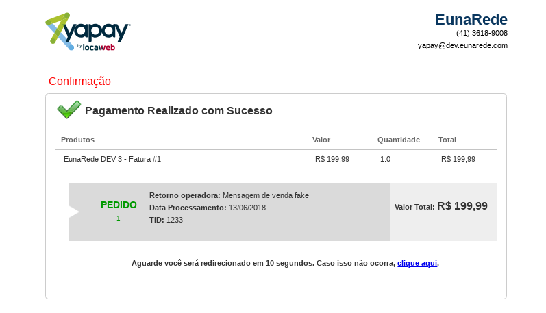

#### Retorno do pagamento

Ao retornar para o seu portal WHMCS, o cliente irá visualizar a “Confirmação do Pedido”:

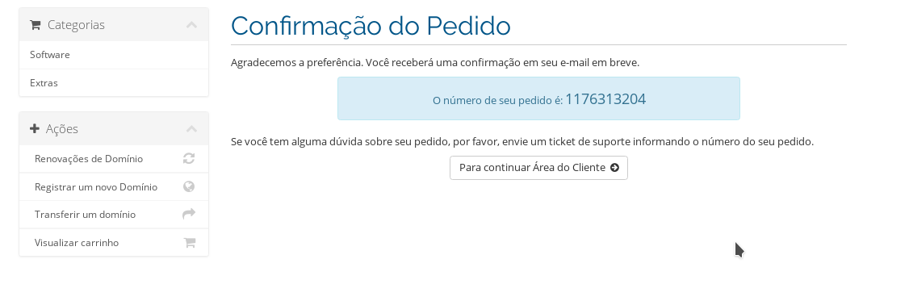

A partir deste ponto, é possível conferir o pagamento, clicando no menu `Addons -> Yapay WHMCS Controle`, na guia pagamentos:

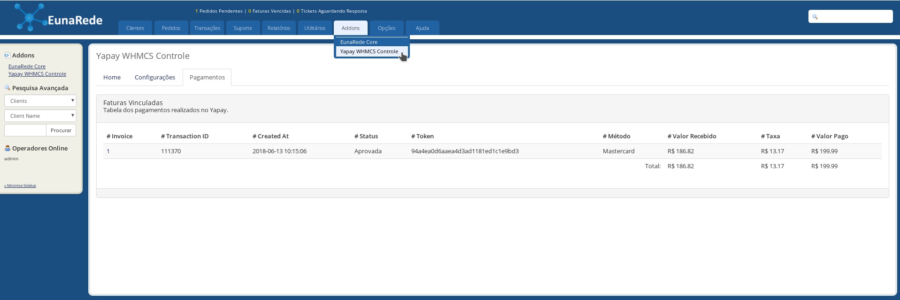

O cliente também poderá verificar sua fatura clicando no menu “Faturas->Minhas Faturas”, conforme abaixo:

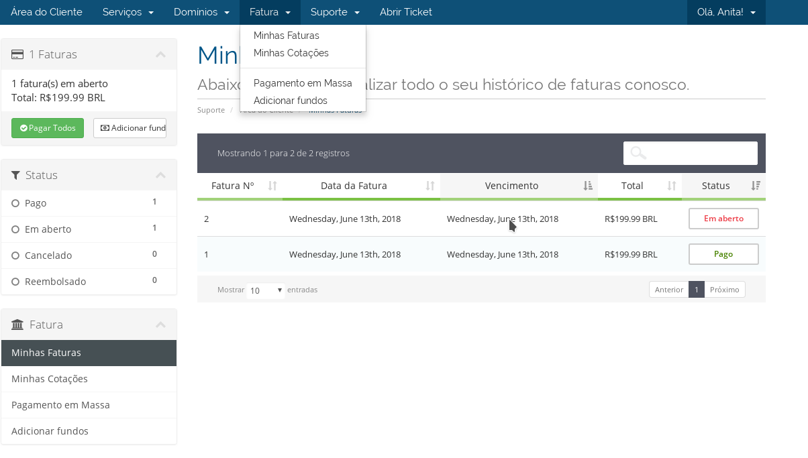

Ao clicar na fatura paga, será visualizada sua fatura como “PAGO”:

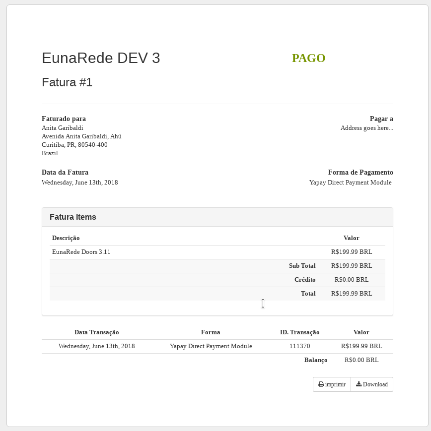

O administrador também poderá acompanhar suas transações no menu `Transações->Lista de Transações`:

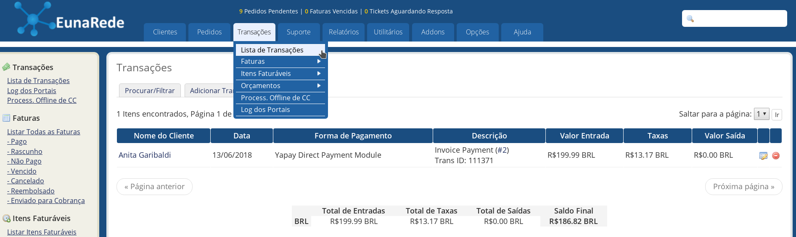

