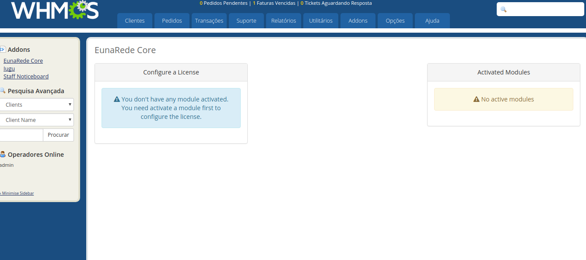

The modules developed by EunaRede require the installation and activation of the base module called **EunaRede Core**. The EunaRede Core module enables the management and maintenance of the modules offered to be carried out in a standardized and planned way, following a software life cycle.

!! ensure that the EunaRede Core module is enabled **before** activating the acquired module.

## Upload to FTP

Download the module in the downloads area in your control panel, unzip and upload to the respective directory `modules/addons`.

## Activating the module

After you submit the directory, go to your WHMCS admin panel and go to **Setup > Addon Modules**. Activate the EunaRede Core module.

## Configuring Access Permissions

Configure the access permissions for the groups you want. You must configure at least the administrator group to be able to access the module.

After activation, you can access the module through the **Addons > EunaRede Core** menu. By activating a EunaRede module, you can confirm your license through this support module. If there are no active modules, a message will be displayed as in the image below.

!!!! Now you can install and activate any of EunaRede Modules. 

From this point, follow the settings specified in each active module.