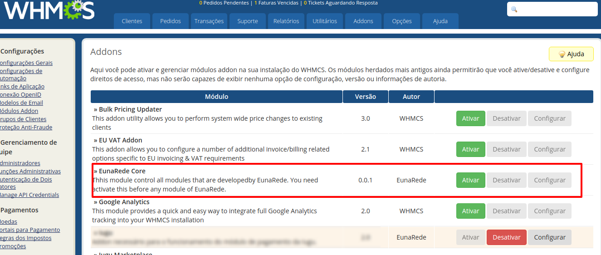
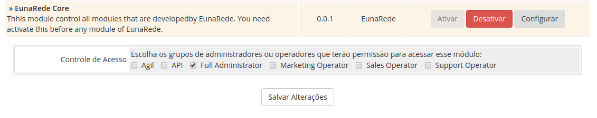

Os módulos desenvolvidos pela EunaRede necessitam da instalação e ativação do módulo base que chamamos de **EunaRede Core**. O módulo EunaRede Core possibilita que a gestão e manutenção dos módulos oferecidos sejam realizadas de maneira padronizada e planejada, seguindo um ciclo de vida do software.

!! garanta que o módulo EunaRede Core esteja ativado **antes** de ativar o(s) módulo(s) adquirido(s)

## Upload via FTP

Baixe do módulo na área de downloads no seu painel de controle, descompacte e realize o upload para o no diretório `modules/addons`

## Ativando o módulo

Após enviar o diretório, acesse o seu painel de administração do WHMCS e vá para **_Opções > Módulos Addon_**. Ative o módulo **EunaRede Core**

## Configurando permissões de acesso

Configure as permissões de acesso para os grupos desejados. Você precisa configurar ao menos o grupo do administrador para que seja possível acessar o módulo.

Após a ativação, você poderá acessar o módulo através do menu **Addons > EunaRede Core**. Ao ativar um módulo da EunaRede, você poderá configurar sua licença através deste módulo de apoio. Caso não existam módulos ativo, será exibida uma mensagem como na imagem abaixo.

A partir deste ponto, siga as configurações especificadas em cada módulo ativo.