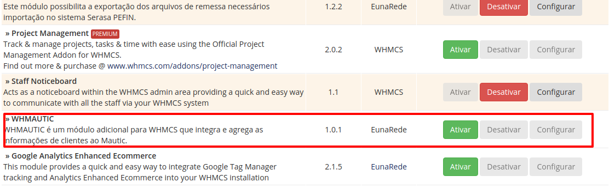
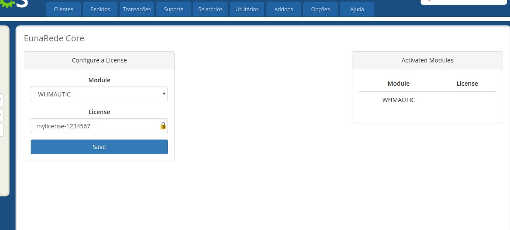
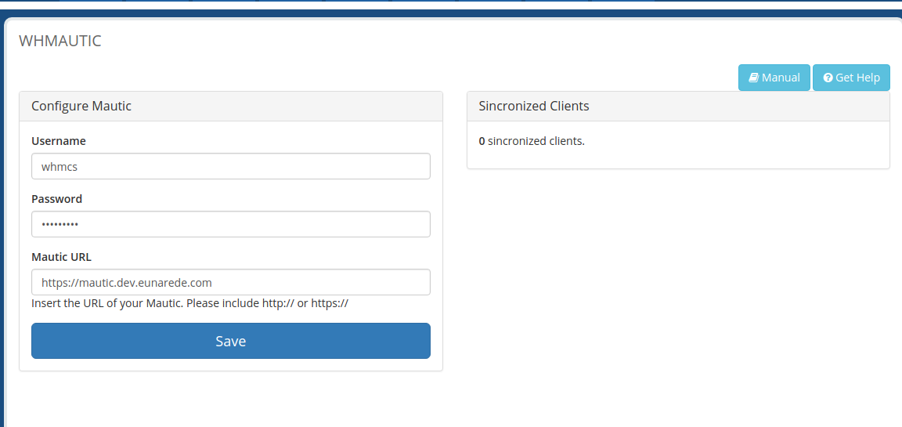

## Activating the Module

Activate the **Whmautic module** trouht the menu **Setup > Addon Modules**.

## Configuring the License

After activating the module, configure the license through the **EunaRede Core Module**. Select WHMAUTIC in the drop-down menu and enter the license code number provided in your order.

## Configuring the Module

The process of configuring the module is simple, with the username and password in hands created in the previous step (if you did not create it, see the step [Enabling API and Authentication on Mautic](/whmautic/ativando-a-api-e-autenticacao-no-mautic)) and the URL, set the respective fields:

* **Username**: usarname of mautic user
* **Password**: password
* **Mautic URL**: URL of your Mautic (please include _http://_ or _https://_, ex. `https://mautic.example.com`)

## Synchronizing Clients

Now your Mautic will receive each new client record in WHMCS and will synchronize every change of customer data on WHMCS into Mautic Contact. If a customer who already has a WHMCS account updates their information, it will be automatically created and synchronized on Mautic.

!! this module **does not synchronize** already registered users. If you want to force the synchronization, simply save the data of the client profile in the administration area.

