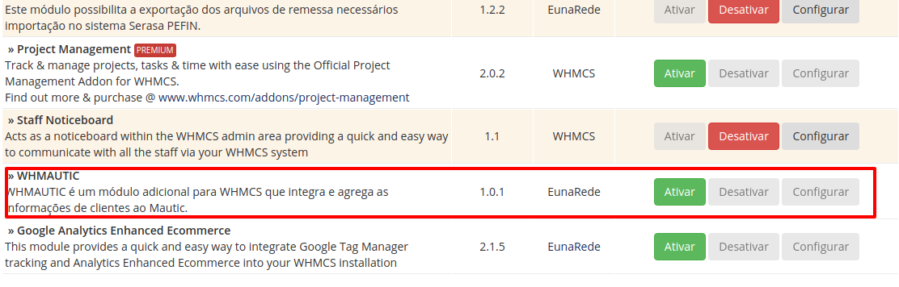
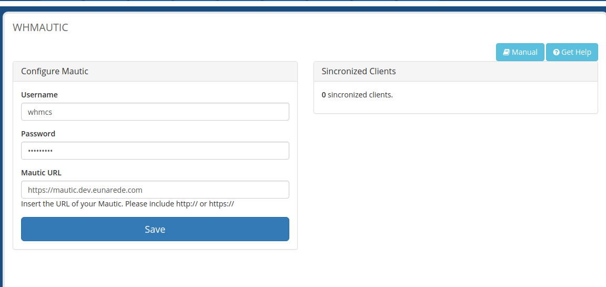

## Ativando o módulo

Ative  o módulo **WHMAUTIC** através do menu **Opções > Módulos Addons**

## Configurando a licença

Após a ativação do módulo, configure a licença através do móduo **EunaRede Core**. Selecione no menu dropdown **WHMAUTIC** e no campo licença insira o número da licença disponibilizada no seu pedido.

## Configurando o Módulo

O processo de configuração do módulo é simples, com as informações em mãos do usuário criado na etapa anterior (caso não tenha criado, veja a etapa [Ativando a API e autenticação no Mautic](/ativando-a-api-e-autenticacao-no-mautic)) e a _URL_ do seu Mautic, configure os campos a seguir:

* **Username**: nome do usuário criado no Mautic
* **Password**: senha do usuŕio criado no Mautic
* **Mautic URL**: URL de instalação do Mautic (incluir _http://_ ou _https://_ de acordo com a configuração do seu Mautic)

## Sincronizando Clientes

Agora seu Mautic receberá a cada novo cadastro no WHMCS os dados do seu cliente, e realizará a sincronização a cada alteração dos dados do cliente no WHMCS. Caso um cliente que jápossua cadastro no WHMCS realize a atualização dos seus dados, ele será automáticamente criado e sincronizado no Mautic.

!! Este módulo **não** sincroniza os cadastros dos clientes até que eles sejam editados. Informações inseridas no Mautic **não** refletirão no WHMCS.

