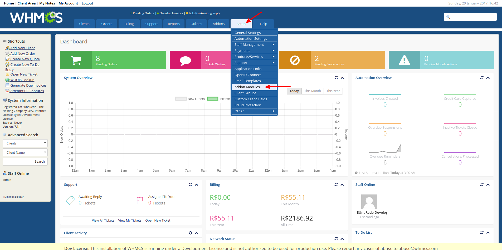
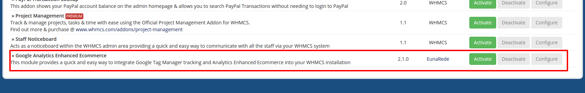
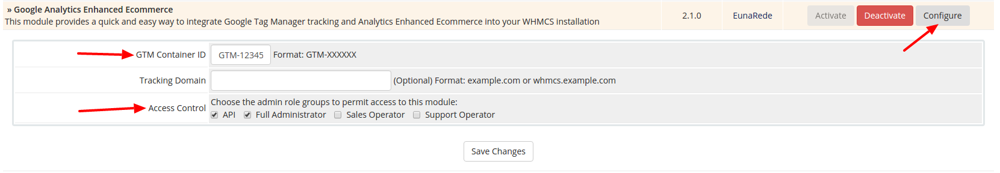

## Module Setup

The setup of Google Analytics Enhanced Ecommerce is very simple. Follow the steps bellow.

### Activate the Addon Module

Go to ``` Setup >> Addon Module``` to activate the Google Analytics Enhanced Ecommerce.


Locate the module and click on **Activate** button.


### Configure the Container ID

After sucessuly activate the module, you need configure the Google Tag Manager container ID. This ID can be retrive from your [Google Tag Manager account](https://tagmanager.google.com). Information about create a new container ID can be found on [Tag Manager Configuration steap](/whmcs-gtm/tag-manager-configuration).

* **GTM Container ID**: insert your containder ID here (required field);
* **Tracking Domain**: if you track more than one domain with tha same container, fill this with the appropriate domain;
* **Access Control**: Configure the desired permissions.



### Done!

Now the Google Analytics Enhanced Ecommerce are configured! Follow the next steps to configure [Tag Manager](/whmcs-gtm/tag-manager-configuration) and [Google Analytics](/whmcs-gtm/google-analytics-configuration)