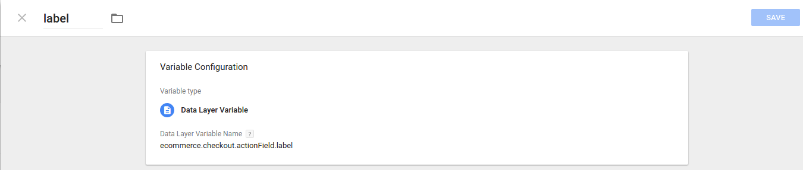

## Add variables

To your module works as promised, you will need to configure some variables in the container ID for WHMCS previously created.

### Variable _label_

Add a new variable called ```label``` with this properties:
* Variable type: **Data Layer Variable**
* Data Layer Variable Name: **```ecommerce.checkout.actionField.label```**
* Data Layer Version: **Version 2**


[plugin:youtube](https://youtu.be/cvNFem-Z_I4)