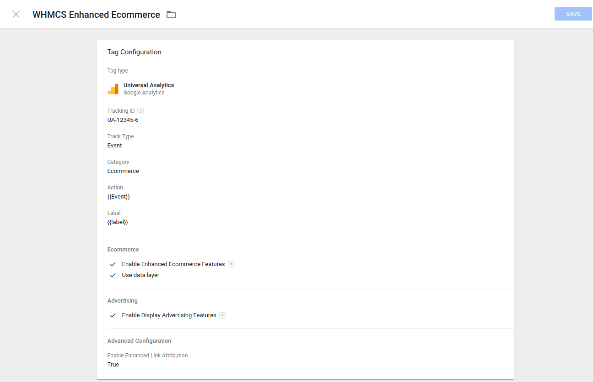
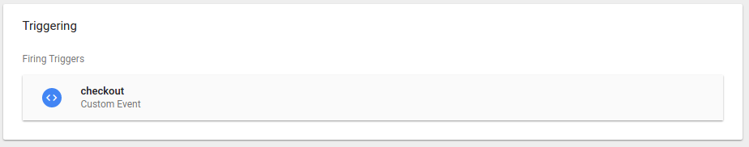

## Add a Tag

A tag is a piece of code that sends information to a third party, such as Google Analytics.

### Deploying Google Analytics Tag for WHMCS

!! On May 2017 Google Tag Manager have been update the Google Analytics Tracking code and variables, now the Ecommerce settings and Datalyer settings have your configuration under the _Google Analytics Settings Variables_, check this update on **[Deploying Google Analytics](https://support.google.com/tagmanager/answer/6107124?hl=en&ref_topic=6333310#use)**

Google Tag Manager allows you to deploy Google Analytics using the Universal Analytics template. To install a Google Analytics tag for WHMCS, create a new tag and select Google Analytics as the tag type. Select the trigger **checkout** for the tag to fire.

* Tag name: **```WHMCS Enhanced Ecommerce```**
* Tag type: **Universal Analytics**
* Tracking ID: **UA-xxxxx-x**
* Track Type: **Event**
* Category: **```Ecommerce```**
* Action: **Event**
* Label: **label**
* More Settings > Ecommerce: **Enable Enhanced Ecommerce Features** and **Use data layer**
* More Settings > Advertising: **Enable Display Advertising Features**
* More Settings > Advanced Configuration: **Enable Enhanced Link Attribution** 
* Triggering: **select the checkout trigger**




[plugin:youtube](https://youtu.be/aJMNTEGomeA)