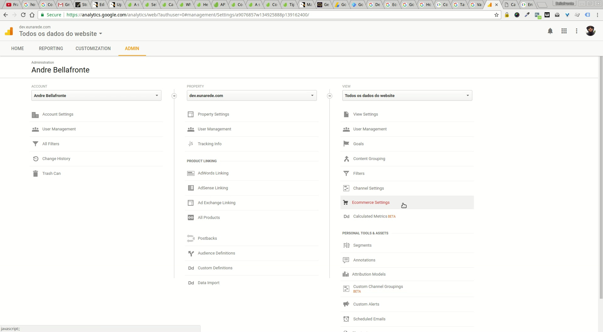

## Enable Enhanced Ecommerce Reporting on Google Analytics

To enable Google Analytics to perform the metrics, you need enable the option **"Enhanced Ecommerce Reporting**, Go to **Admin > Account > Property > View> Ecommerce Settings**, select the account that  you will use and there **Property**.

[plugin:youtube](https://youtu.be/M6y09k_QClk)

## Enable enhanced link attribution

To better track your visitors, we recommend enable the option **enhanced link attribution** on **Property Settings**.

[plugin:youtube](https://youtu.be/2cSU_lA8_Ws)

