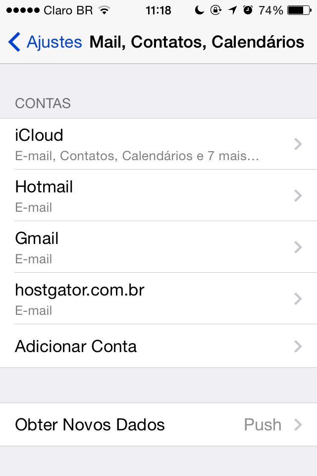
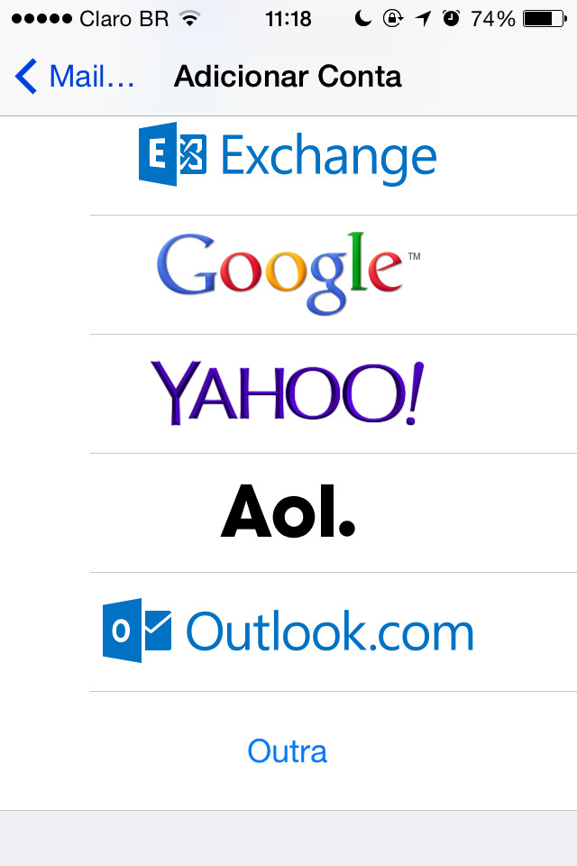

! É importante destacar que para está FAQ vamos utilizar dominio.com.br no local onde você deve inserir o seu domínio.
1. Na tela inicial do seu dispositivo, vá em "**Ajustes**".
2. Na lista de opções, vá em "**Mail, Contatos, Calendários**".
3. Selecione "**Adicionar Conta**":

4. Escolha a opção “**Outra**”:

5. Onde esta escrito e-mail, vá em “**Adic. Conta do Mail**”.
6. Insira os dados:
	a. **Nome**: Nome para Exibição.
	b. **E-mail**: email@dominio.com.br.
	c. **Senha**: senha da conta de e-mail.
	d. **Descrição**: Descrição da conta para exibição no dispositivo.
7. Para dar continuidade, clique em “**Seguinte**” no canto superior direito.
8. Em “**Servidor de Correio de Entrada**” insira os dados:
	a. **Nome do host**: mail.dominio.com.br
    b. **Nome do usuário**: email@dominio.com.br
    c. **Senha**: Senha da conta de e-mail
9. Mais abaixo, em “**Servidor de Correio de Saída**”, insira os dados:
	a. **Nome do host**: mail.dominio.com.br
    b. **Nome do usuário**: email@dominio.com.br
    c. **Senha**: Senha da conta de e-mail