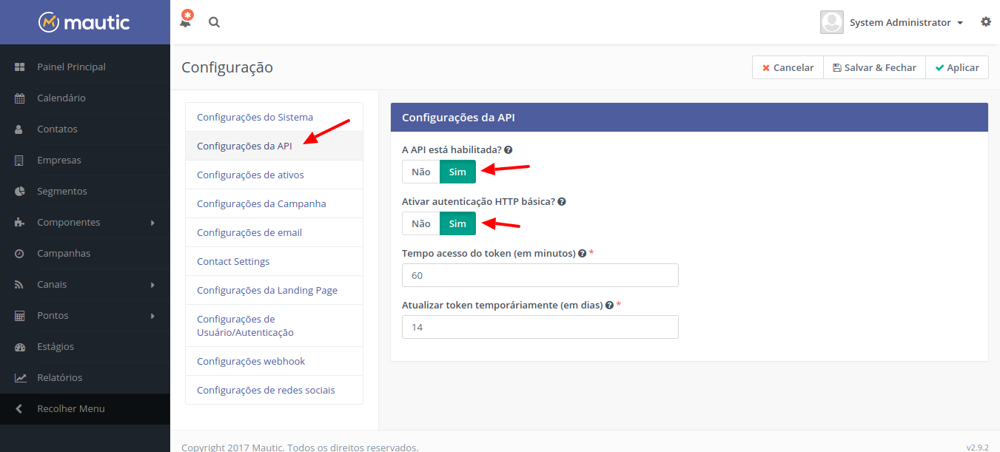
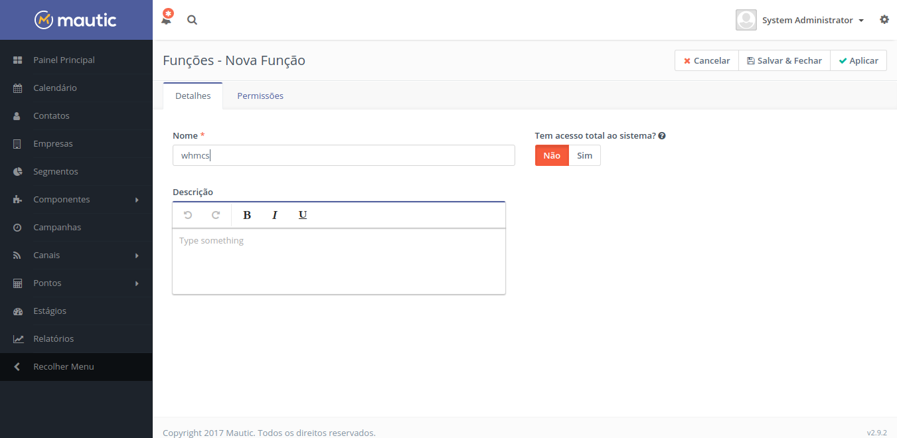
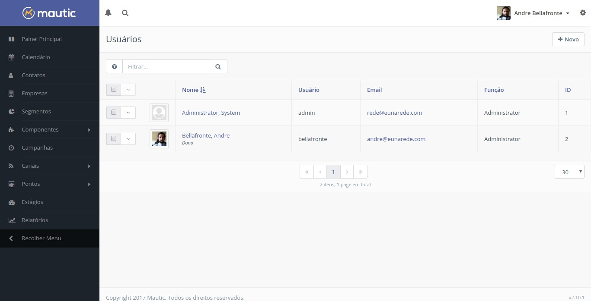
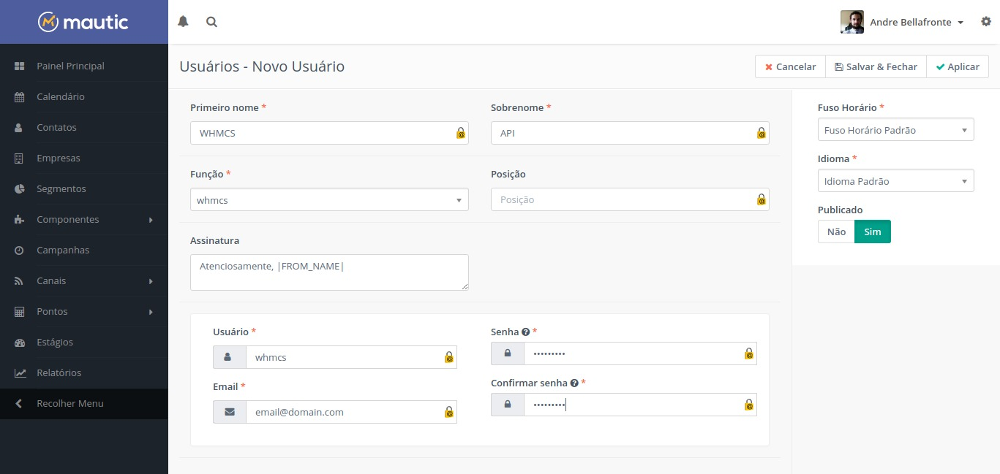

[TOC]

## Ativando a API e autenticação no Mautic

Este módulo utilização a API do Mautic para realizar suas operações, é necessário que sua instalação do Mautic esteja com a API e autenticação HTTP habilitados.

Para ativar a API, acesse o Mautic e selecione a opção configurações clicando sobre a roda no canto superior direito.

No menu lateral acesse “Configurações da API”, marque sim para as opções “A API está habilitada?” e “Ativar autenticação HTTP básica?”

## Adicionando usuário na função

Por questões de segurança, sugerimos que você crie uma regra de acesso para o usuário a ser configurado no WHMCS. Este usuário necessita de acesso completo nas permissões para poder manipular de forma corretas as informações através da API. Para criar uma nova função, acesse a roda no canto superior direito e acesse a opção “**Função**”. Clique no botão “**Novo**”, no campo “**Nome**” defina como `whmcs`.

Marque **sim** na opção **Tem acesso total ao sistema?** para que este conjunto de funções recebera acesso completo ao Mautic.

## Criando o usuário

Por questões de controle e segurança, crie um usuário que será usado somente pelo WHMCS. Clique sobre a roda no canto superior direito e acesse a opção “**Usuários**”. Clique em “**Novo**” e adicione um usuário com informações que ajudem a identificar nos logs caso necessário.

Sugerimos os seguintes:
* **Primeiro nome:** WHMCS
* **Sobrenome:** API
* **Função:** whmcs (caso não tenha criado as permissões e funções, reveja a etapa anterior)
* **Usuário:** whmcs

Guarde este usuário e senha con segurança.

!!!! sempre utilize uma senha complexa